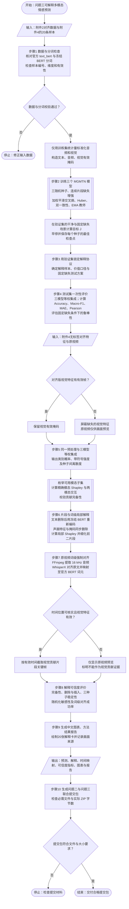

```mermaid
flowchart TD
    S([开始：问题三可解释多模态情感预测])
    I[/输入：附件2对齐数据与附件4的20条样本/]
    C1[步骤1 数据与分词检查<br/>核对官方 text_bert 与冻结 BERT 分词<br/>检查样本编号、维度和有效性]
    D1{数据与分词校验通过？}
    E1([停止：修正输入数据])
    P1[仅用训练集统计量标准化音频和视觉<br/>构造文本、音频、视觉有效掩码]

    T1[[步骤2 训练三个 MGMTN 模型<br/>三随机种子、连续片段缺失增强<br/>加权平滑交叉熵、Huber、双一致性、EMA 教师]]
    V1[在验证集的干净与固定缺失场景计算目标 J<br/>早停并保存每个种子的最佳检查点]
    L1[步骤3 用验证集锁定解释协议<br/>确定解释样本、价值口径与固定缺失测试方案]
    X1[步骤4 测试集一次性评价<br/>三模型等权集成；计算 Accuracy、Macro-F1、MAE、Pearson<br/>评估固定缺失条件下的鲁棒性]

    I4[/输入：附件4无标签对齐特征与原视频/]
    D4{对齐版视觉特征有有效帧？}
    VY[保留视觉有效掩码]
    VN[屏蔽缺失的视觉特征<br/>原视频仅供画面预览]
    M4[步骤5 同一预处理与三模型等权集成<br/>输出类别概率、带符号强度及种子间离散度]
    G4[[枚举可用模态子集<br/>计算精确模态 Shapley 与两模态交互<br/>校验贡献完备性]]

    L4[[步骤6 片段与词级局部解释<br/>文本删除后用冻结 BERT 重新编码<br/>声画特征与掩码同步删除<br/>计算局部 Shapley 并细化前二片段]]
    W4[步骤7 原视频词级强制对齐<br/>FFmpeg 提取 16 kHz 音频<br/>WhisperX 对齐原文并映射至官方 BERT 词元]
    Q4{时间位置可核实且视觉特征有效？}
    F4[按有效时间截取视觉贡献片段关键帧]
    P4[仅显示原视频预览<br/>标明不能作为视觉贡献证据]

    R4[步骤8 解释可信度评价<br/>完备性、删除与插入、三种子稳定性<br/>随机化敏感性及词级对齐成功率]
    H4[步骤9 生成中文图表、方法结果报告<br/>绘制20张解释卡并记录画面来源]
    O4[/输出：预测、解释、时间映射、可信度指标、图表与报告/]
    B4[步骤10 生成问题二与问题三联合提交包<br/>检查必需文件与实际 ZIP 字节数]
    DB{提交包符合文件与大小要求？}
    EB([停止：检查提交材料])
    END([结束：交付合格提交包])

    S --> I --> C1 --> D1
    D1 -- 否 --> E1
    D1 -- 是 --> P1 --> T1 --> V1 --> L1 --> X1 --> I4 --> D4
    D4 -- 是 --> VY --> M4
    D4 -- 否 --> VN --> M4
    M4 --> G4 --> L4 --> W4 --> Q4
    Q4 -- 是 --> F4 --> R4
    Q4 -- 否 --> P4 --> R4
    R4 --> H4 --> O4 --> B4 --> DB
    DB -- 否 --> EB
    DB -- 是 --> END

```