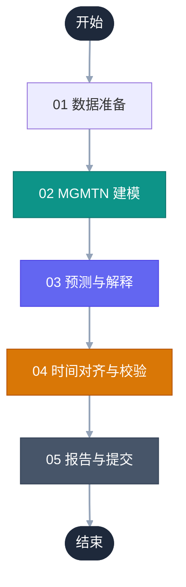

```mermaid
flowchart TD
    S([开始]) --> A["01  数据准备"]
    A --> B["02  MGMTN 建模"]
    B --> C["03  预测与解释"]
    C --> D["04  时间对齐与校验"]
    D --> E["05  报告与提交"]
    E --> Z([结束])

    classDef terminal fill:#1E293B,stroke:#1E293B,color:#FFFFFF
    classDef blue fill:#2563EB,stroke:#1D4ED8,color:#FFFFFF
    classDef teal fill:#0D9488,stroke:#0F766E,color:#FFFFFF
    classDef violet fill:#6366F1,stroke:#4F46E5,color:#FFFFFF
    classDef amber fill:#D97706,stroke:#B45309,color:#FFFFFF
    classDef slate fill:#475569,stroke:#334155,color:#FFFFFF
    class S,Z terminal
    class A lblue
    class B teal
    class C violet
    class D amber
    class E slate
    linkStyle default stroke:#94A3B8,stroke-width:2px

```