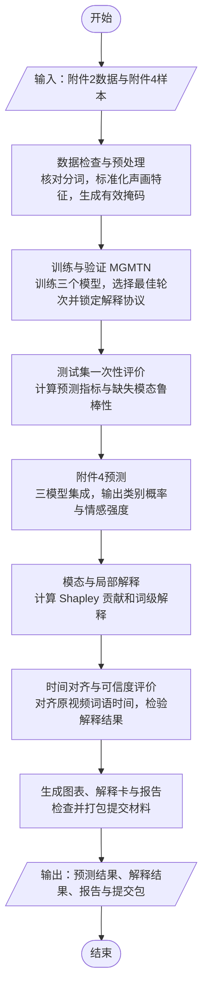

```mermaid
flowchart TD
    S([开始])
    I[/输入：附件2数据与附件4样本/]
    P1[数据检查与预处理<br/>核对分词，标准化声画特征，生成有效掩码]
    P2[训练与验证 MGMTN<br/>训练三个模型，选择最佳轮次并锁定解释协议]
    P3[测试集一次性评价<br/>计算预测指标与缺失模态鲁棒性]
    P4[附件4预测<br/>三模型集成，输出类别概率与情感强度]
    P5[模态与局部解释<br/>计算 Shapley 贡献和词级解释]
    P6[时间对齐与可信度评价<br/>对齐原视频词语时间，检验解释结果]
    P7[生成图表、解释卡与报告<br/>检查并打包提交材料]
    O[/输出：预测结果、解释结果、报告与提交包/]
    E([结束])

    S --> I --> P1 --> P2 --> P3 --> P4 --> P5 --> P6 --> P7 --> O --> E

```